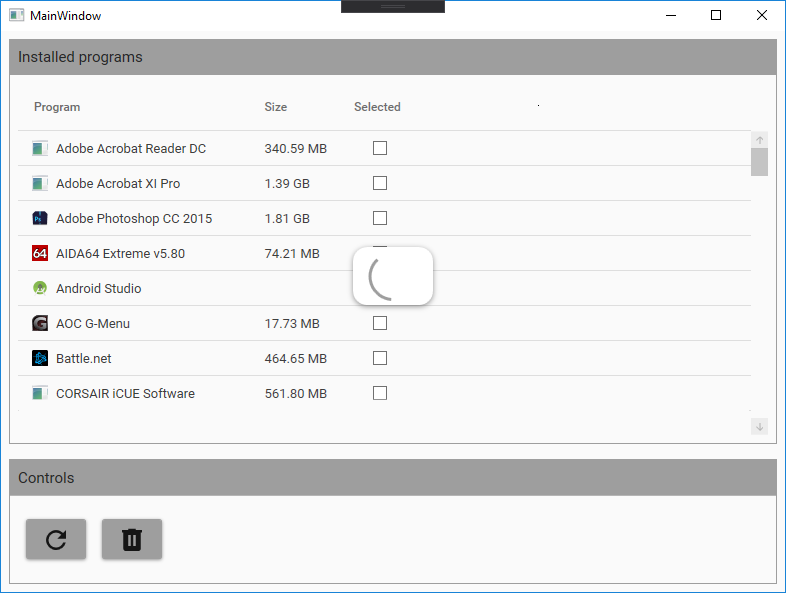

# BulkUninstaller
App that lets you uninstall multiple apps at once not like in control panel where each app has to finish uninstalling to proceed

## Description
Opening up the app will load all installed programs 
(that are register in Registry entries so that control panel recognizes them).
Since not all apps provide their estimated size, the app will try to count all file sizes under install location
hence the size might be actually lower than the app occupies.
When uninstalling multiple apps at once there might be many promts at once, 
since the uninstall .exe file might spawn other processes which actually do the work. 
Keeping track of those is a bigger task than the benefits.

## Future development

The app could use a better UX like seeing how many apps (or which apps) have been selected
or how many are left to uninstall (this might be deceiving because of above mentioned process behavior),
though this could be transformed to "how many processes are waiting to be uninstalled".

## Screens
